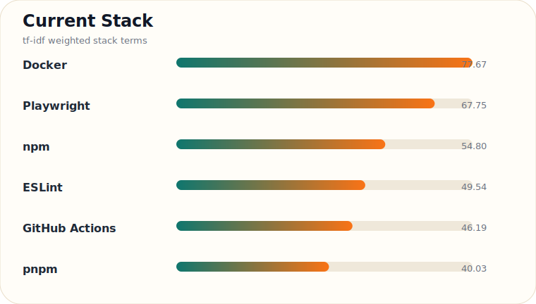
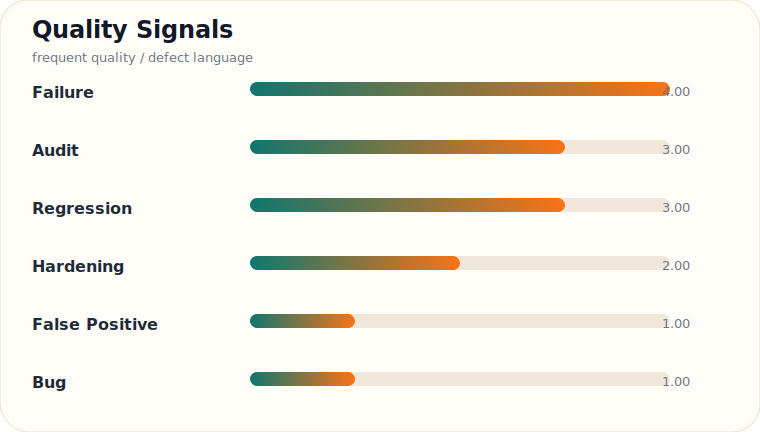

# Engineering Activity Snapshot

匿名化した最近のGitHub活動を、技術スタック・品質シグナル・テーマの3層で要約しています。

_Updated: 2026-06-06 16:37 UTC_

**Current focus**

`Docker` `Playwright` `npm` `ESLint` `GitHub Actions`

**Quality signals**

`Failure` `Audit` `Regression` `Hardening` `False Positive`

**Theme areas**

`documentation` `developer tooling` `product flows` `ci/cd` `selectors and dom`

  
  

> Full semantic dashboard: [https://hryknkmr.github.io/hryknkmr/](https://hryknkmr.github.io/hryknkmr/)

