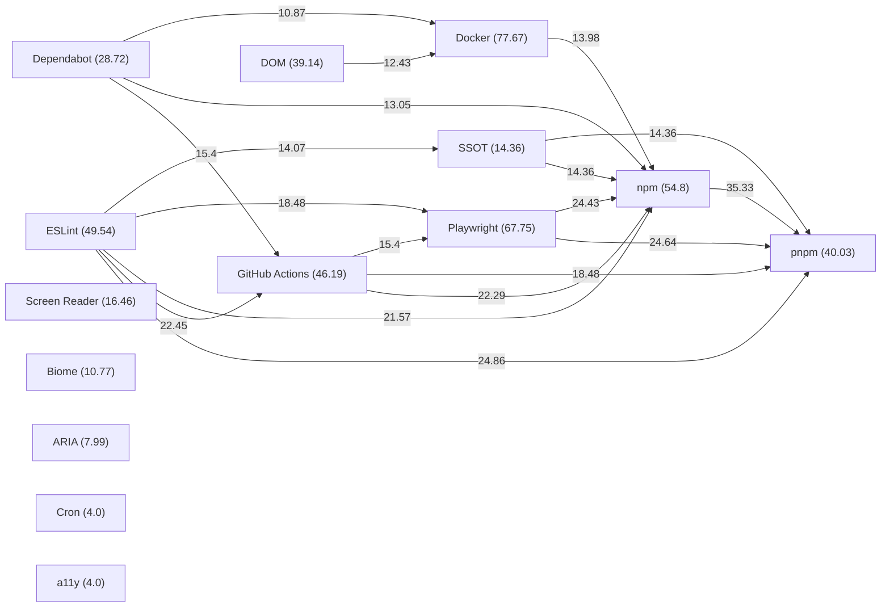
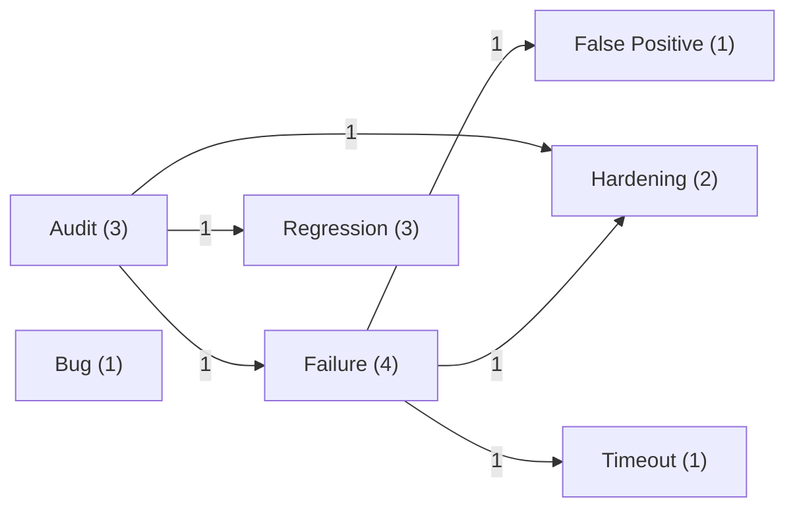
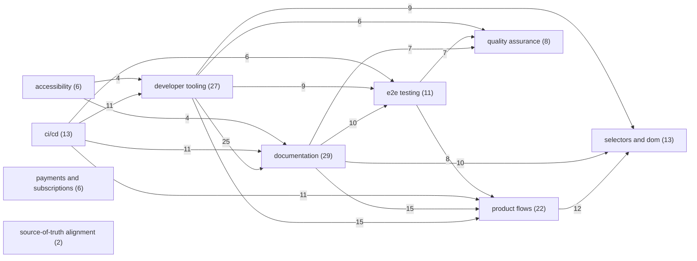

# Activity Semantic Network

匿名化した最近の GitHub 活動から、一般的な技術スタックと品質シグナルを意味ネットワークとして可視化しています。

- Snapshot: `2026-06-06T16:27:27.683102+00:00`
- Scope: recent pull requests and issues authored by this account
- Owners included: `hryknkmr`, `AxonRelay`
- Keep: `SSOT`, `Playwright`, `a11y`, `WCAG`, `axe`, `GitHub Actions` など一般技術語
- Hide: 組織名、個人名、案件名、製品ベンダー固有名、URL、メール、長いID

## Stack Graph (TF-IDF)

## Signal Graph

## Theme Graph

